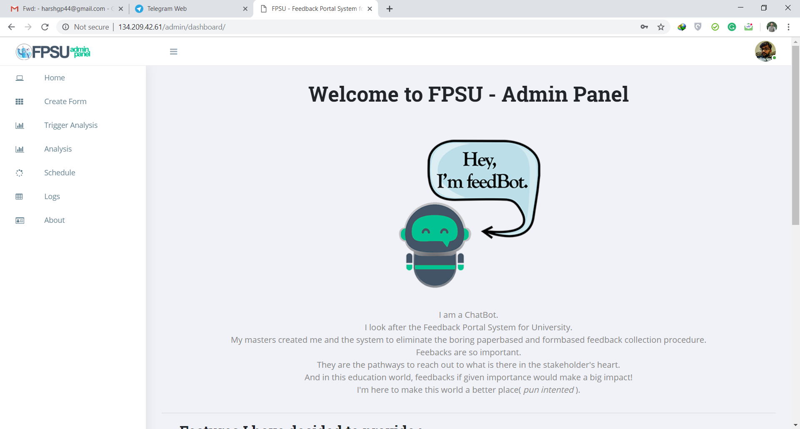
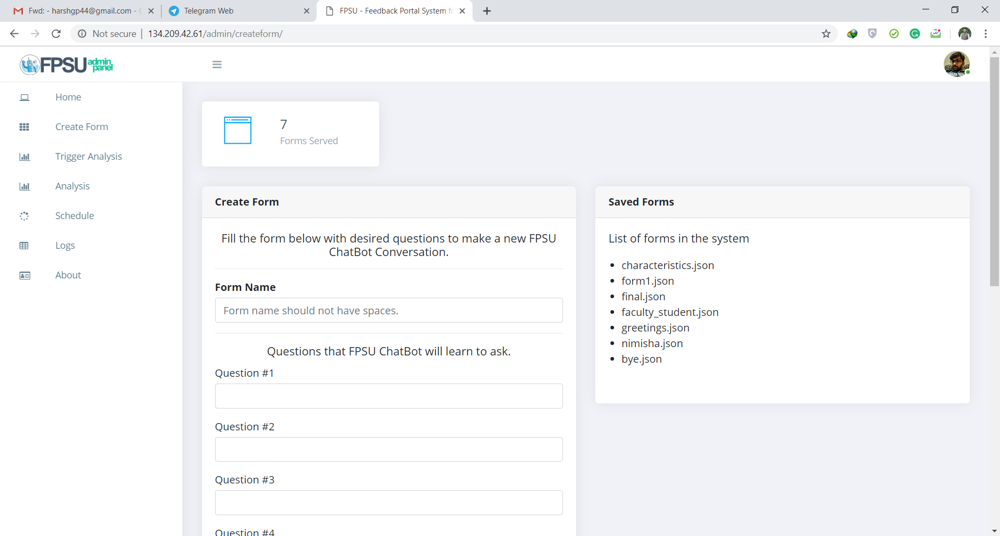
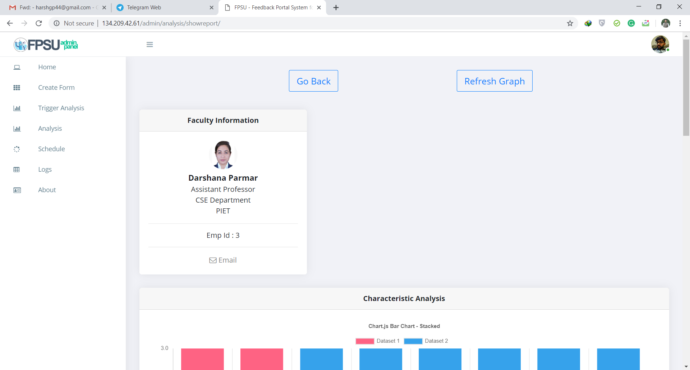
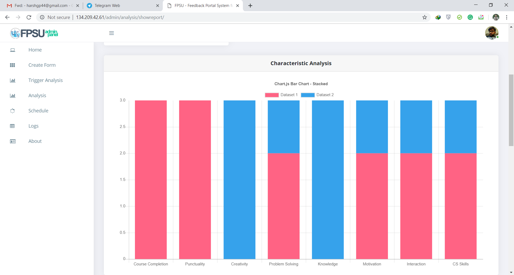
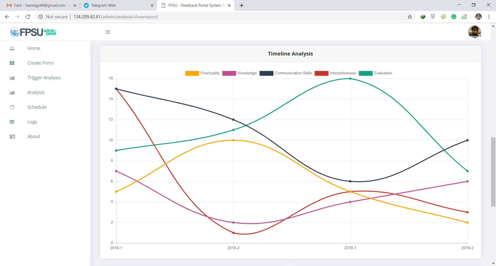
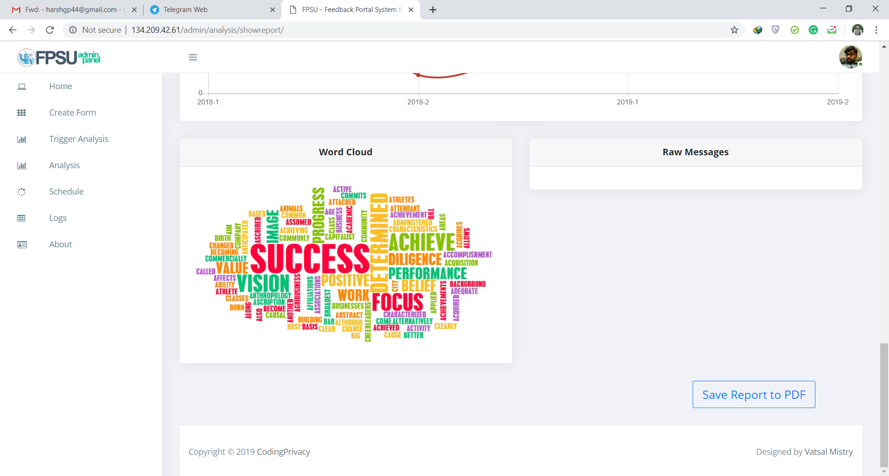
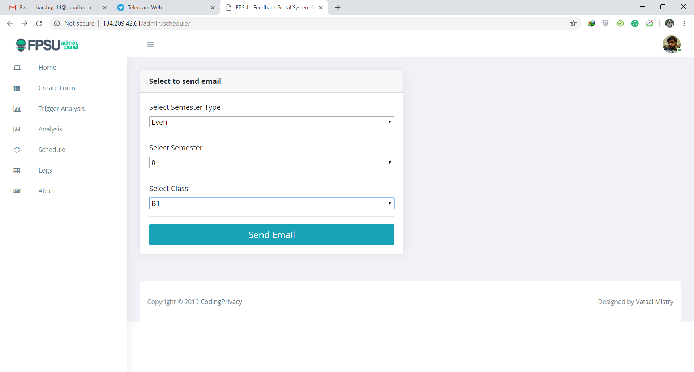
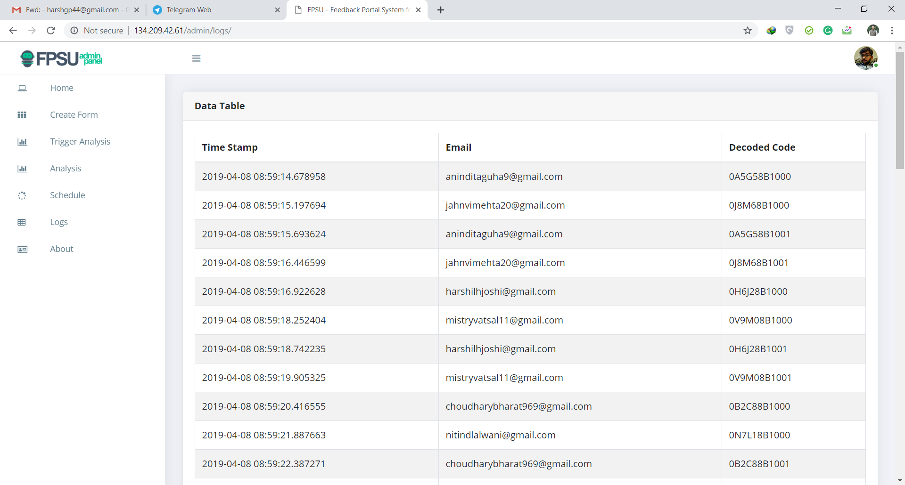
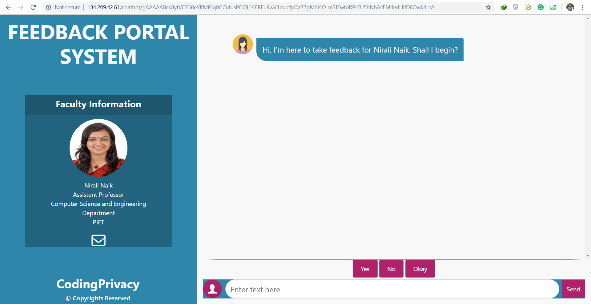

<h2>
  Overview
</h2>

  This is a system which has been developed to operate in the current fast world we are living in. Feedbacks are necessary for improvement of any institution or organization. This system will be able to take periodic feedbacks from an educational institution using a chatbot in a human friendl way. There will be no predefined questions, the question generated will depend on the response of the user. Since the system will deal with lot of chats and emotions, sentiment analysis and natural language processing will come into the picture. Moreover, data analytics is needed to analyse and seggregate the data. Machine Learning algorithms will be needed in order to customize and prepare the chatbot.

<i><b>requirements.txt</b> contains all the required libraries for the backend developement.</i> 
<i><b>Presentation/report.pdf</b> contains elaborated information about our project including the architecture of the system.</i>
<h2>Technology stack, algorithms, concepts implemented in the project</h2>

  &emsp;&emsp;&emsp;&emsp;1. HTML/CSS/JS for frontend 
  &emsp;&emsp;&emsp;&emsp;2. Flask framework for bakend programming 
  &emsp;&emsp;&emsp;&emsp;3. Logistic regression for sentiment analysis 
  &emsp;&emsp;&emsp;&emsp;4. Natural language processing for creating chatbot 
  &emsp;&emsp;&emsp;&emsp;5. Data analysis 
  &emsp;&emsp;&emsp;&emsp;6. Data visualization 
  &emsp;&emsp;&emsp;&emsp;7. MySQL as a database 

<h2>Screenshots of the Website</h2>
    <h4><b>Home page</b></h4>
    
    
This is the home page of the website. It contains information about the system. On the left side are the options to select the task.

    <h4><b>Create forms</b></h4>
    
    
This is the page to create forms. we can use the default form or the we can also create new form by creating questions. On right, you can see the saved forms in the database.

    <h4><b>Analysis & Vizualization</b></h4>
    
    
    
    
    
This images shows the analysis of the responses generated using feedback from users. All the analysis are visualized in such a manner that it can be understood very easily and can reveal many insights. These vizualizations can be used take business decisions or improve the organization.
    Vizualizations includes Characteristic analysis shown using bar graph containing many different characteristics of the person, Timeline analysis of the person showing change of those characteristics with time, wordcloud showing most frequent words used in the responses of his/her feedback, and finally some important responses are presented to understand the results.
    

    <h4><b>Scheduling emails</b></h4>
    
    
This page is used to set the schedule for triggering the service i.e. mailing users the link to use FeedBot to provide responses using a chatbot.

    <h4><b>Maintaining logs</b></h4>
    This page shows logs of the system. It shows who have been sent an email and its token key which is an encrypted personal key in the database. The token key is generated so the user's feedback stays anonymous and no other user can give feedback on behalf of him/her.

    <h4><b>FeedBot chatbot</b></h4>
    
    
Last but very important part of the system, this is our chatbot. Users open this chatbot using the link they get in the e-mail. They talk with a chatbot and provide their responses on the person. This feedback is then analyzed and vizualized on the website portal which we saw in above images.

    <i><b>Presentation/images</b> contains other screenshots of the website.</i>
<h2>Developers</h2>

&emsp;&emsp;&emsp;&emsp;1. Anindita Guha 
&emsp;&emsp;&emsp;&emsp;2. Harsh Patel 
&emsp;&emsp;&emsp;&emsp;3. Nitin Lalwani 
&emsp;&emsp;&emsp;&emsp;4. Vatsal Mistry 

